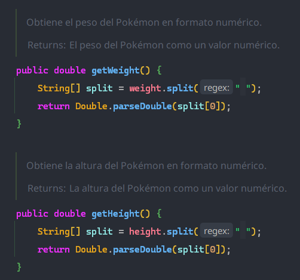
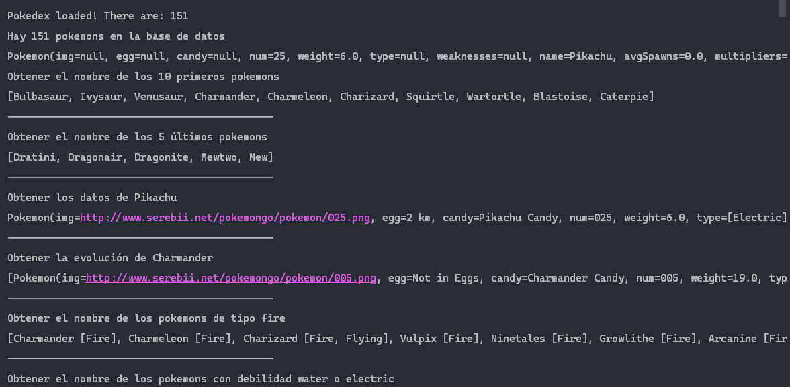

# Práctica Pokemons de Jaime Medina y Eva Gómez
## Funcionamiento principal

**¿DE QUE TRATA?**  
En este proyecto hemos realizado la lectura de un fichero de tipo JSON, así como la obtención de datos a través de la API de colecciones funcionales. Para guardar estos datos contamos con la clase Pokemon que contiene todos sus atributos y la clase DataBaseManager y weatherManager para guardar estos datos en una base de datos.
## Base de datos
**DataBaseManager**  
En la carpeta services nos encontramos con la clase **DataBaseManager**, esta clase se encarga de lo relacionado con la base de datos. En esta clase el método a destacar es openConnection, en él cargamos las propiedades del archivo database.properties con la clase **Properties**, establecemos la conexión con **DriverManager** y ejecutamos el archivo *init.sql* en el que tenemos la sentencia para crear la tabla Pokemon.

**PokedexManager**  
La clase PokedexManager se encarga de gestionar la interacción con una base de datos que almacena información de Pokémon. Permite realizar operaciones como guardar un Pokémon en la base de datos, buscar Pokémon por nombre y recuperar todos los Pokémon almacenados.

## Pokemon
**PokemonController**  
Es la responsable de gestionar la información   y las operaciones relacionadas con Pokémon. Proporciona una interfaz para acceder y manipular los datos de la Pokedex, así como realizar consultas y cálculos específicos sobre los Pokémon almacenados, algunos de los métodos a destacar serían:

    public Double getAverageWeaknesses() 

Calculamos la media de debilidades entre los pokemons, para ello convertimos el stream de debilidades en un doubleStream y sacamos la media con **.average()**.

    public String mostCommonWeakness()  

Sacamos la debilidad más común agrupando los pokemon por debilidad con **Collectors.groupingBy()** y sacamos el máximo valor de la lista con **.max()**.

    public void exportToCSV() 

Exporta los datos de Pokemon a un CSV usando **.toCSV()**, con **joining(\n)** unimos los strings y los separamos con un salto de linea.

     public void readCSV()   

Lee los datos de Pokémon desde un archivo CSV, con **.skip(1)** saltamos la primera línea, usamos map para convertir cada línea en un array de Strings y luego imprimimos cada array.

**Pokemon**
La clase pokemon es la clase POJO en la que almacenamos todos los atributos de cada pokemon, como pecularidad, en los métodos getters de la altura y el peso hemos tenido que separar la cadena de texto usando el espacio, ya que por ejemplo en el peso contabamos con 45,2 kg, y después de separarlo obtenemos solo el valor numérico. Esto lo hacemos gracias a .split y se hace de la siguiente forma:

## Ejecución

Para ejecutar el programa se utiliza la clase main, en esta nos encontramos con la instancia de pokedexManager, pokemonController y la clase DataBaseManager. Tenemos un bucle para guardar en la tabla POKEMON todos los objetos Pokemon que están en la pokedex de pokemonController.
Para obtener la información filtrada que nos pide el ejercicio llamamos a los métodos indicados de pokemonController y mostramos el resultado que nos da. Después de llamar a estos métodos llamaremos también a exportToCsv y readCSV para crear un csv en el que estén todos los pokemon y posteriormente leer el csv y mostrar los datos por pantalla.
Si todo es correcto nos debería aparecer esto al ejecutar y deberíamos de tener un csv nuevo llamado *pokemon.csv*:

